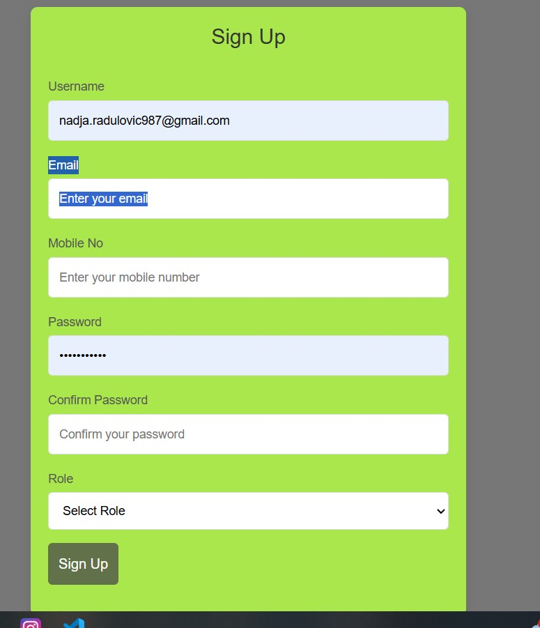

# Aplikacija za trenere - Pronađi trenera

## Opis projekta

 Ovo je full-stack aplikacija za trenere koja omogućava klijentima da pretražuju trenere po lokaciji, obliku saradnje i ceni takođe da ih ubaci u favorite ili ih sačuva. Klijent će moći da izlista trenera, zakaže saradnju na kalendaru, i da pošalje zahtev treneru. Dok sa druge strane trener će moći da napravi svoj profil, prihvati ili odbije saradnju. Aplikacija je rađena u express.js backend-u, koristeći MySql bazu, dok je frontend radjen u React-Vite.

 ## Tehnologije

 ### Frontend (Klijent)
  - React
  - Vite
  - React Bootsrap
  - React Router
  - React Navigate
  - Axios
  - React toastify
  - React Mui Material
  - React-Leaflet
  - Jwt-decode
  - Framer-Motion

  ### Backend (Server)

  - Express.js
  - Cors
  - MySql
  - Bcryptjs
  - JsonWebToken

  ## Pokretanje aplikacije
  ### 1. Pokreni backend
  U folderu **server projekta code**, pokreni server:
   ```bash
   node server.js
   nodemon server.js 
   ```

   ### 2. Pokreni frontend
 U folderu **pronadjitrenera**, pokreni frontend:
   ```bash
   npm run dev
   ```
   

   ### 3. Otvori aplikaciju
   Kad dobiješ localhost na kojem je aplikacija pristisnes **o** i enter i otvoriće se aplikacija u browseru

   ## Izgled aplikacije

   ### Home page
   

   ### Registracija
   